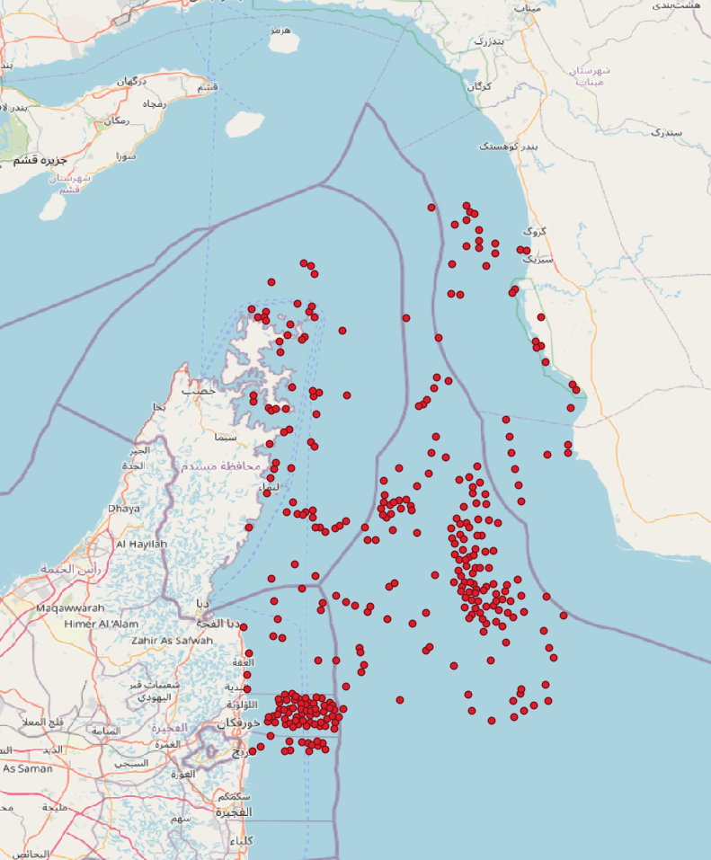

# SAR Ship Detection Pipeline

Automated ship detection in the Strait of Hormuz using Sentinel-1 SAR data and YOLOv8.

## How it works

1. Downloads Sentinel-1 GRD scenes from Microsoft Planetary Computer
2. Merges multiple scenes to cover the full area of interest
3. Creates a sea mask using Natural Earth land polygons
4. Runs YOLOv8 inference on 640x640 tiles across the scene
5. Deduplicates detections and filters land false positives
6. Exports results as GeoJSON

## Example output



## Installation
```bash
conda create -n sar-ships python=3.11
conda activate sar-ships
pip install -r requirements.txt
```

## Usage
```bash
# Run with default config (Hormuz, 2026-03-16)
python pipeline.py

# Custom date
python pipeline.py --date 2026-03-10

# Custom bbox (min_lon min_lat max_lon max_lat)
python pipeline.py --date 2026-03-16 --bbox "56.35 25.24 57.28 26.66"
```

## Output

GeoJSON file saved to `outputs/ships_{date}.geojson` with point features:
```json
{
  "type": "Feature",
  "geometry": { "type": "Point", "coordinates": [56.87, 25.76] },
  "properties": { "confidence": 0.83 }
}
```

## Dependencies

- [Microsoft Planetary Computer](https://planetarycomputer.microsoft.com/) - free Sentinel-1 data access
- [YOLOv8](https://github.com/ultralytics/ultralytics) - object detection
- [hewitleo/sar-ship-detection-yolov8](https://huggingface.co/hewitleo/sar-ship-detection-yolov8) - pretrained SAR model

## Limitations

- Sea mask uses Natural Earth 1:10m polygons — coastline accuracy ~500m
- Detection quality depends on sea state and wind conditions
- Large bboxes require significant RAM (>4GB)