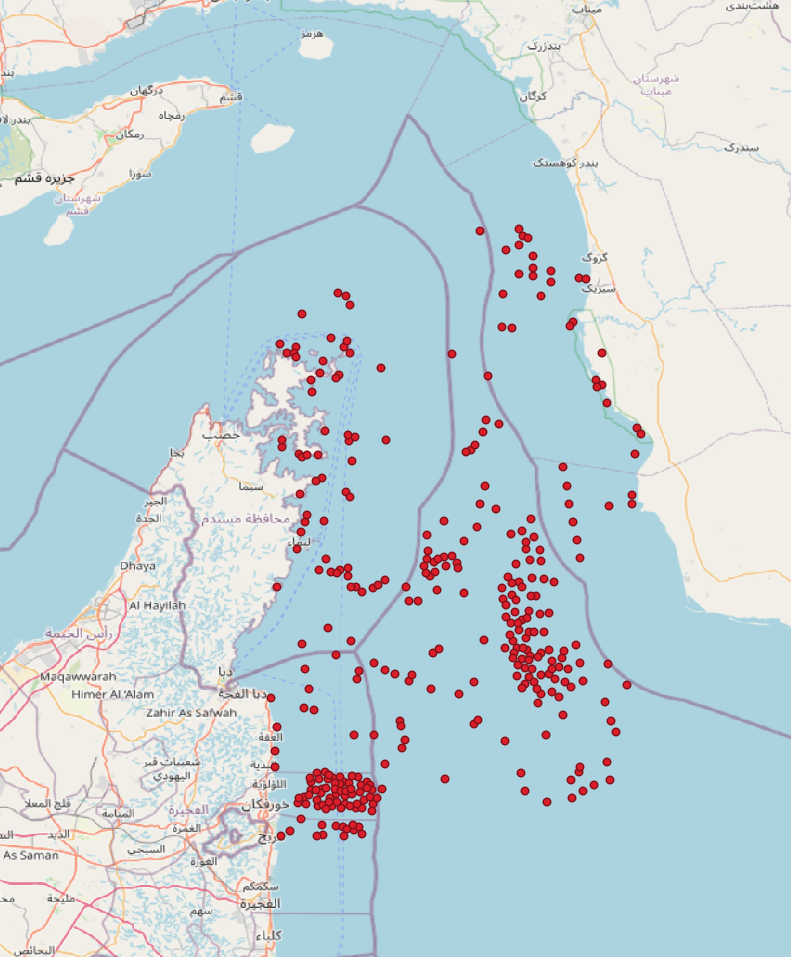

# 🚢 SAR Ship Detection Pipeline



An automated, end-to-end geospatial ML pipeline for detecting ships in Sentinel-1 Synthetic Aperture Radar (SAR) imagery. 

## 🚀 Project Overview

This project streams Sentinel-1 GRD data via STAC API, processes large-scale satellite imagery through dynamic tiling, and utilizes a fine-tuned YOLOv8 model for object detection. It handles complete coordinate transformations and geospatial post-processing to deliver clean, georeferenced data.

**Tech Stack:** `Python` | `YOLOv8` | `STAC API` | `Rasterio` | `GeoPandas` | `OpenCV`

## ⚙️ How It Works (The Pipeline)

1. **Serverless Data Retrieval:** Queries and merges Sentinel-1 scenes directly from the Microsoft Planetary Computer using **STAC API** (`pystac_client`, `odc.stac`). No manual downloading required.
2. **Geospatial Preprocessing:** Dynamically generates vector-based sea masks using Natural Earth datasets (`GeoPandas`, `Rasterio`) to filter out landmasses and reduce false positives.
3. **Tiled ML Inference:** Splits massive SAR arrays into 640x640 overlapping tiles, normalizes pixel values dynamically, and runs **YOLOv8** detection.
4. **Post-processing & NMS:** Converts pixel coordinates back to geographic coordinates (EPSG:4326), applies Non-Maximum Suppression (NMS) to deduplicate overlapping bounding boxes, and filters out land detections.
5. **Vector Export:** Outputs ready-to-use, georeferenced point detections as a `GeoJSON` FeatureCollection.

## Installation
```bash
conda create -n sar-ships python=3.11
conda activate sar-ships
pip install -r requirements.txt
```

## Usage
```bash
# Run with default config (Hormuz, 2026-03-16)
python pipeline.py

# Custom date
python pipeline.py --date 2026-03-10

# Custom bbox (min_lon min_lat max_lon max_lat)
python pipeline.py --date 2026-03-16 --bbox "56.35 25.24 57.28 26.66"
```

## Output

GeoJSON file saved to `outputs/ships_{date}.geojson` with point features:
```json
{
  "type": "Feature",
  "geometry": { "type": "Point", "coordinates": [56.87, 25.76] },
  "properties": { "confidence": 0.83 }
}
```

## Dependencies

- [Microsoft Planetary Computer](https://planetarycomputer.microsoft.com/) - free Sentinel-1 data access
- [YOLOv8](https://github.com/ultralytics/ultralytics) - object detection
- [hewitleo/sar-ship-detection-yolov8](https://huggingface.co/hewitleo/sar-ship-detection-yolov8) - pretrained SAR model

## Limitations

- Sea mask uses Natural Earth 1:10m polygons — coastline accuracy ~500m
- Detection quality depends on sea state and wind conditions
- Large bboxes require significant RAM (>4GB)
